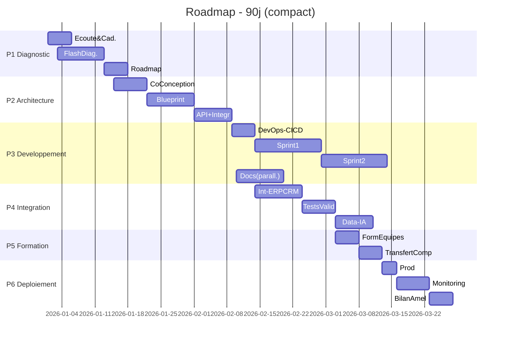

# 👋 Régis Scyeur 

**Digital Transformation Architect • Lead Developer • Coach**

🦓 **[Zebra Puma Services](https://zebrapuma.be)** • 🧠 **[Un Autre Moi Coaching](https://unautremoi.org/)**

📍 Belgique & Maroc • 🌍 Remote Available

**. NET Framework • SQL Server • API Integration • DevOps CI/CD • Coaching PNL**

## 👋 Qui je suis

Je suis **Régis Scyeur, Digital Transformation Architect, Lead Developer, Coach**, basé entre la Belgique et le Maroc. 

**Multi-potentiel** par nature, je travaille avec des PME qui veulent **vraiment** faire avancer leur transformation digitale — pas juste empiler des outils, mais créer de la cohérence, de la valeur, et faire en sorte que tout fonctionne ensemble.

## 🦓 Zebra Puma Services ✨ Un Autre Moi Coaching

Passionné par **l’humain** et **la technologie**, j’ai vite constaté, alors qu’elles sont essentielles, que ces deux dimensions faisaient souvent défaut dans les entreprises.

Pour combler ce manque, j’ai créé Zebra Puma Services 🦓 et Un Autre Moi Coaching ✨ :
Deux univers complémentaires qui associent accompagnement humain et technologique au service des PME et ETI.

Avec **Zebra Puma Services**, j’accompagne et facilite le changement technologique.

Je guide les choix stratégiques pour garantir la pérennité, la cohérence et le ROI, et j’assure la mise en œuvre concrète : intégration des systèmes, automatisation, exploitation des données et sécurisation des processus.

Avec Un Autre Moi Coaching, j’accompagne le changement humain, pour que les équipes évoluent avec les outils et que la technologie serve l’humain, et non l’inverse.
Parce que dans un monde où **l’Intelligence Artificielle prend de plus en plus de place**, l’humain reste la clé pour donner du sens et créer de la valeur.

## 🎯 Ce que je fais

Je conçois et j’orchestre des systèmes qui parlent entre eux : CRM, ERP, e-commerce, données dispersées… Je les fais communiquer via des API, j’automatise ce qui peut l’être, j’exploite intelligemment tes données (data-mining, IA pragmatique), et je mets en place des pipelines robustes pour que tout reste stable et évolutif.

Mon rôle :

Donner la ligne directrice et assurer la cohérence technique
Former et faire monter en compétence tes équipes
Coordonner les acteurs internes et externes pour que tout avance ensemble

On brainstorme, on trouve des solutions, et on construit des systèmes durables.

## 🔄 Ma méthode

J'écoute d'abord. Vraiment. Ton métier, tes contraintes, tes ambitions. Ensuite, **on co-conçoit** une trajectoire **réaliste, mesurable et durable**. Pas de solution imposée d'en haut — on réfléchit ensemble, on teste, on ajuste. Et je forme tes équipes pour qu'elles puissent prendre le relais.

## 🔄 Mon Approche

    

## 💼 Domaines d'Intervention

| Domaine                              | Description |
|--------------------------------------|-------------|
| **🏗️ Architecture & Développement** | Architecture . NET, SQL Server, Windows, Linux pour des solutions robustes et pérennes |
| **🔗 Intégration Multi-Systèmes & Orchestration API** | Connexion de systèmes métiers (CRM, ERP, e-commerce) via API REST/SOAP pour des processus fluides |
| **📊 Data-Mining Multi-Source & IA Pragmatique** | Agrégation, nettoyage intelligent, détection d'anomalies, classification pour valoriser vos données |
| **🚀 End-to-End Digital Integration & DevOps** | Pipelines GitHub Actions, CI/CD, qualité, observabilité, delivery sécurisé |
| **📋 Gestion de Projet Agile** | Pilotage de projets, coordination équipes internes & prestataires externes |
| **🎓 Coaching PNL** | Accompagnement du changement, alignement humain-tech pour faciliter l'adoption et la collaboration ([Un Autre Moi Coaching](https://unautremoi.org/)) |

## 📦 Livrables

| Livrable | Description |
|----------|-------------|
| **📋 Diagnostic & Feuille de Route** | Analyse de l'existant + roadmap 90 jours actionnable |
| **🏛️ Architecture & Blueprint API** | Schéma d'intégration multi-systèmes documenté |
| **💻 Programmes** | Code source structuré, testé et maintenable |
| **📚 Documentations** | Guides techniques, procédures, bonnes pratiques |
| **🧪 Tests & Rapports** | Tests complets et réproductibles |
| **📦 Packages** | Librairies réutilisables, modules métier |
| **⚙️ Pipelines CI/CD** | GitHub Actions configuré avec standards qualité |
| **📊 Tableaux de Bord** | Mesure & pilotage en temps réel |

## 🎯 Mes Services

| Service | Description | Format |
|---------|-------------|--------|
| **👔 Interim / Fractional CTO - Lead** | Orchestration & coordination continue | Accompagnement |
| **🎓 Coaching / Formation Équipes** | Adoption tech & PNL | Temps passé |
| **🔍 Diagnostic Flash** | Analyse + roadmap 90 jours | Mission |
| **🏗️ Architecture & Dev** | Solutions . NET/SQL + intégration ERP | Mission/Forfait |
| **🔗 Intégration API** | Connexion systèmes métiers | Forfait |
| **🚀 DevOps Setup** | CI/CD GitHub Actions complet | Forfait |

## 🚀 Projets Professionnels : 🦓 ZebraPuma Framework & Ecosystem

| Projet | Description | Version | Licence |
|--------|-------------|---------|---------|
| **[ZebraPuma Framework](https://github.com/ZebraPuma/ZebraPuma)** | Framework professionnel . NET pour applications modulaires • Architecture de plugins extensible • Support .NET Framework 4.8 et .NET 10 • Services Windows avancés • Chargement dynamique et auto-découverte |  | Propriétaire |
| **[ZebraPuma Framework Documentation](https://zebrapuma.github.io/ZebraPuma-Framework/)** | Documentation complète du framework • Guides de démarrage rapide • Référence API complète • Exemples de code |  | - |
| **[ZebraPuma.Plugins](https://github.com/orgs/ZebraPuma/packages?repo_name=ZebraPuma-Framework)** | Package NuGet - Système de plugins extensible • Chargement dynamique depuis DLL • Auto-découverte dans les dossiers • Configuration JSON flexible • Résolution automatique des dépendances |  | Propriétaire |
| **[ZebraPuma.System.ServiceProcess](https://github.com/orgs/ZebraPuma/packages?repo_name=ZebraPuma-Framework)** | Package NuGet - Extensions pour services Windows • Installation/désinstallation de services • Contrôles Windows Forms • Surveillance et gestion de l'état • Intégration complète avec plugins |  | Propriétaire |
### 🎯 Points Forts
- **🏗️ Architecture SDK-Style moderne** : Multi-targeting . NET Framework 4.8 et .NET 10
- **📦 Distribution NuGet** :  Packages sur GitHub Packages
- **📚 IntelliSense complet** : Documentation XML intégrée
- **🔗 CI/CD** : GitHub Actions pour build, tests et publication automatisés
- **✅ Production-ready** : Utilisé en production chez nos clients

## 🎓 Projets Académiques & Communautaires (Open Source)

| Projet | Description | Licence |
|--------|-------------|---------|
| **[M365-UserGroup-Audit](https://github.com/Regis-Scyeur/M365-UserGroup-Audit)** | Audit et gestion des utilisateurs et groupes Microsoft 365 PowerShell scripts pour l'administration M365 - Partage communautaire |  |
| **[Net-IP-Config-Classic](https://github.com/Regis-Scyeur/Net-IP-Config-Classic)** | Configuration et gestion des paramètres réseau IP classiques Projet académique (2015) démontrant le développement d'utilitaires multi-plateforme, avant .net Core |  |

> 💡 **Ces projets sont partagés librement pour contribuer à la communauté dev et servir de ressources pédagogiques.**

## Gestion de Projet 

## 💡 Localisations

| Pays | Région |
|------|-----------------|
| **🇧🇪 Belgique** | Région Wallone :   Namur, Liège, Brabant Wallon |  
| **🇲🇦 Maroc** | Casablanca, Rabat, Tanger, Marrakech, ...  |

## 💰 Mode de Prestations

| Mode | Description |
|------|-------------|
| **📦 Forfait** | Engagement sur un périmètre et un prix fixe |
| **🎯 Mission** | Objectifs définis (périmètre / résultat), livrables identifiés (audit, architecture, intégration) |
| **⏱️ Temps passé** | Facturation à l'heure, à la journée ou à la session, adapté à l'accompagnement et au support |

---

## 💡 Utilisation et inspiration

Vous êtes libre de vous inspirer de ce profil ! Si vous l'utilisez comme source d'inspiration ou réutilisez des éléments : 

- **Un petit crédit fait toujours plaisir** 😊 — Mentionner [@Regis-Scyeur](https://github.com/Regis-Scyeur) 
- **Pour les images et contenus créatifs** — Merci de conserver mon nom lors du partage
- **N'hésitez pas à me taguer** — J'adore voir comment mon travail inspire les autres ! 

### 📄 Licence

- **Code** : MIT License — Utilisez librement ! 
- **Images & Contenu créatif** : CC BY 4.0 — Partagez avec attribution

> ℹ️ Cette licence concerne uniquement ce profil. Chaque dépôt a sa propre licence. 

Consultez le fichier [LICENSE](./LICENSE) pour plus de détails.

---

## 📫 Me Contacter

### ⭐ **Diagnostic Flash Gratuit - Roadmap 90 Jours**

**** • **🦓 [ZebraPuma](https://zebrapuma.be)** • **🧠 [Un Autre Moi Coaching](https://unautremoi.org/)**

## 📚 Mes Activités

- **[ZebraPuma](https://zebrapuma.be)** - Transformation Digitale pour PME
- **[Un Autre Moi Coaching](https://unautremoi.org/)** - Coaching PNL & Développement Personnel
- **[LinkedIn](https://www.linkedin.com/in/rscyeur)** - Profil professionnel & Articles

**💡 "Écoute et réflexion avant toute transformation, amélioration ou création."**

